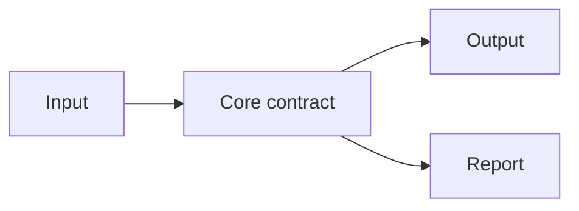

# Plan V1 工作文件模板

## 0. 文件資訊

| 項目 | 內容 |
|---|---|
| Plan version | v1 |
| Owner | 待填 |
| Created | 待填 |
| Source documents | 待填 |
| Status | Draft |

相關專家報告放在同一目錄：

```text
plan/plan_v1/plan_v1_expert1.md
plan/plan_v1/plan_v1_expert2.md
plan/plan_v1/plan_v1_expert3.md
plan/plan_v1_decisions.md
```

## 1. Problem and goal

### Problem

待填：描述目前問題、限制與造成的影響。

### Goal

待填：描述完成後的可觀察結果。

### Non-goals

- 待填：明確不處理的範圍。
- 待填：不應被誤解為已完成的能力。

## 2. Existing system and constraints

### Observed facts

| Fact | Evidence |
|---|---|
| 待填 | file/path/command |

### Existing behavior to preserve

- 待填：既有 API、資料流、UI 行為或測試結果。
- 待填：不得破壞的相容性。

### Integration boundaries

- 待填：核心 model。
- 待填：外部 API。
- 待填：資料庫或檔案格式。
- 待填：部署邊界。

## 3. Requirements

| ID | Requirement | Scope | Acceptance |
|---|---|---|---|
| R-001 | 待填 | In/Out | 待填 |

## 4. Proposed architecture



### Module responsibilities

| Module | Responsibility | Must not do |
|---|---|---|
| 待填 | 待填 | 待填 |

### Data contracts

```text
待填：輸入、輸出、identity、version、error contract。
```

## 5. Decision matrix

| Decision | Option | Benefit | Cost/Risk | Recommendation | Owner decision |
|---|---|---|---|---|---|
| D-001 | A / B | 待填 | 待填 | 待填 | Pending |

每個高影響決定必須記錄：

- 被拒絕的選項。
- 拒絕原因。
- 取捨。
- 受影響的模組與測試。

## 6. Expert review

### Requested experts

| Expert | Scope | Status | Report |
|---|---|---|---|
| 待填 | 待填 | Pending | `plan_v1_expert1.md` |

### Findings summary

| ID | Severity | Finding | Plan response |
|---|---|---|---|
| F-001 | BLOCKER/HIGH/MEDIUM/LOW | 待填 | Accept/Reject/Defer |

不可把失敗的 agent 當作通過 review。失敗結果必須標示為 unavailable evidence。

## 7. Ordered implementation plan

依下列依賴順序排列 task：

```text
existing behavior baseline
→ contracts and semantic model
→ identity and references
→ pure core logic
→ adapters
→ UI surfaces
→ generated artifacts
→ external service integration
→ governance and production hardening
```

| Wave | Task | Depends on | Deliverable | Acceptance |
|---|---|---|---|---|
| V1-0 | Baseline and safety boundary | None | 待填 | 待填 |
| V1-1 | Core contract | V1-0 | 待填 | 待填 |
| V1-2 | Pure implementation | V1-1 | 待填 | 待填 |
| V1-3 | Adapter/UI | V1-2 | 待填 | 待填 |
| V1-4 | External integration | V1-3 | 待填 | 待填 |

## 8. Verification and regression gates

### Existing behavior gate

- [ ] Existing test baseline recorded。
- [ ] Existing fixtures unchanged。
- [ ] Existing API behavior unchanged。
- [ ] Existing UI flow unchanged。
- [ ] Rollback boundary defined。

### New behavior gate

- [ ] Unit/contract tests。
- [ ] Integration tests。
- [ ] E2E tests。
- [ ] Error and edge-case tests。
- [ ] Unsupported behavior report。

### Release gate

- [ ] Security review。
- [ ] Performance check。
- [ ] Accessibility check。
- [ ] Deployment check。
- [ ] Owner acceptance。

## 9. Risks and edge cases

| ID | Risk/edge case | Impact | Mitigation | Verification |
|---|---|---|---|---|
| E-001 | 待填 | Blocker/High/Medium/Low | 待填 | 待填 |

## 10. Rollback and non-goals

### Rollback

- 待填：如何移除新 adapter、feature flag 或 generated artifact。

### Non-goals

- 待填：不在本版處理的項目。

## 11. Final readiness checklist

- [ ] 所有 requirement 有 artifact 與 acceptance。
- [ ] 所有 expert findings 有 response。
- [ ] 所有高影響 decision 已由 owner 確認。
- [ ] Task order 遵守 dependency。
- [ ] Existing behavior 有 regression gate。
- [ ] Lossiness、unsupported、manual-review 有明確狀態。
- [ ] `plan_v1_decisions.md` 與本文件一致。
- [ ] 下一版計劃使用新目錄，不覆蓋本文件。

## 12. Status

```text
Draft
```

更新 status 前，附上驗收證據與未解決問題。