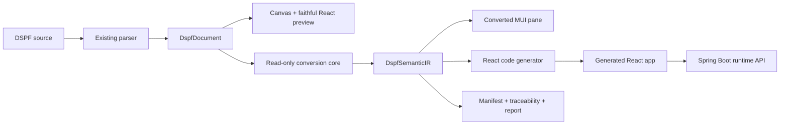

# 00 High-Level System Design

## 1. System purpose

DSPF·RAD converts an IBM i DSPF design into a reviewable Modern React application. The system also keeps the existing 5250 design experience unchanged.

## 2. System boundaries



## 3. Responsibility boundaries

| Area | Responsibility | Must not do |
|---|---|---|
| Existing parser/model/writer | Parse, edit, and round-trip DSPF | Infer business workflow |
| `DspfDocument` | Hold the canonical design document | Become a second runtime store |
| Conversion core | Build Semantic IR and target models | Mutate `DspfDocument` |
| Converted pane | Show a modern candidate layout | Change faithful preview semantics |
| React code generator | Produce source files and traceability | Invent unsupported actions |
| Generated React app | Show screens and send runtime requests | Decide bank permissions |
| Spring Boot | Own session, transaction, authorization, and audit | Reimplement DSPF conversion rules |
| Optional Node service | Wrap shared conversion core for batch/API use | Become a second conversion core |

## 4. Main functions

### F-01 Parse and preserve

```text
read DSPF source
parse source into DspfDocument
write source without conversion side effects
```

### F-02 Build semantic IR

```text
read DspfDocument
resolve DSPSIZ profile
classify record relations
build identities and references
collect AID, indicator, window, message, and subfile semantics
return DspfSemanticIR
```

### F-03 Convert layout

```text
read DspfSemanticIR
select conversion profile
map source geometry to target 12-grid
record source and target geometry
record overlap, crop, reflow, or manual review
return ModernLayoutModel
```

### F-04 Generate React

```text
read Semantic IR and ModernLayoutModel
read binding map and design tokens
write React components, routes, theme, and API client
write manifest, traceability, binding map, and report
```

### F-05 Run the screen

```text
load generated screen
read runtime state from backend
show fields, messages, actions, and subfiles
send AID and field payload
receive next screen state
```

## 5. State ownership

| State | Owner |
|---|---|
| DSPF design | `DspfDocument` |
| Selection | Existing designer/selection bus |
| Converted visual model | Pure conversion result |
| Generated code | Export artifact |
| Server screen state | Spring Boot runtime |
| Server cache | TanStack Query |
| URL navigation state | TanStack Router |
| Form draft | React/component state |
| Approval state | Server-side governance store |

## 6. Release gates

### Gate 0: Legacy safety

- Existing build passes.
- Existing Vitest suite passes.
- Existing Playwright suite passes.
- DSPF round-trip passes.
- Canvas and faithful React parity passes.
- Conversion does not mutate `DspfDocument`.

### Gate 1: Semantic safety

- DSPSIZ is explicit.
- Source identity is qualified.
- References resolve or receive review status.
- Unsupported semantics are visible.
- Layout lossiness is reported.

### Gate 2: Generated app safety

- Generated app builds.
- API contract is versioned.
- Manifest hashes source and output.
- Route and API errors have tests.
- Sensitive data does not enter DOM ids or logs.

### Gate 3: Banking readiness

- Maker-checker and SoD exist.
- Audit events are append-only.
- Session, authorization, idempotency, and reconciliation are tested.
- A checker approves the conversion revision before deployment.
