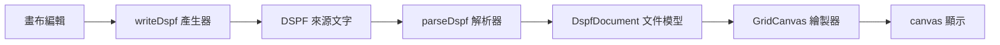
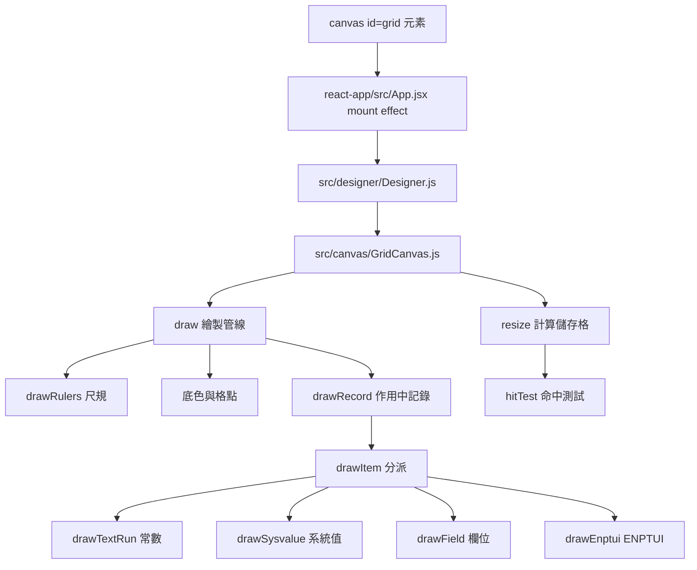

# DSPF 來源程式碼轉換為畫布顯示的原理

本文件依簡明中文規則撰寫。它說明 DSPF 來源程式碼如何轉換為畫布顯示。轉換鏈包含三個階段：解析、模型、繪製。顯示目標是 HTML5 canvas，不是 HTML 標記。來源程式碼不會變成 DOM 元素。

## 轉換管線總覽



DSPF 來源文字進入解析器，變成文件模型。模型再交給繪製器，在 canvas 上顯示。畫布上的編輯會反向產生來源文字。產生器與解析器共用同一種 80 欄格式，所以能來回往返。

## 第一階段：解析

解析器是 `src/parser/parseDspf.js`。輸入是 DSPF 來源文字，輸出是 `DspfDocument`。解析器刻意寬容，接受常見的格式瑕疵。

### 前置處理

`filterAndMergeLines` 先清掉無關的行。只留 form type 是 A 或空白的行。`A*` 開頭的中繼資料、註解與空行都會刪除。以 `+` 或 `-` 結尾的關鍵字續行會合併成一行。`+` 去掉下一行的前導空白，`-` 保留原樣。

### 行解析

`parseSourceLine` 依 80 欄固定格式切分。第 7 到 16 欄是指標，第 17 欄是名稱型別。名稱在第 19 到 28 欄，長度在第 29 到 34 欄，資料型別在第 35 欄。座標在第 39 到 44 欄，關鍵字文字在第 45 欄之後。

### 分派

R 行建立新記錄。具名行建立欄位。有座標的行建立常數或系統值。其餘文字視為關鍵字續行，附加到最近的記錄或項目。相對座標 `+N` 會依前一行的位置換算成絕對座標。無法歸屬的項目會放入合成的 `NONAME` 記錄，解析不會中斷。

## 第二階段：文件模型

`DspfDocument` 是唯一的資料來源。繪製與編輯都讀寫同一個實例。文件包含 `modelKey` 與記錄陣列。`modelKey` 是 `24x80` 或 `27x132`，決定終端機尺寸。開啟檔案時，`DSPSIZ` 會自動決定 `modelKey`。

記錄包含名稱、型別、項目陣列與關鍵字陣列。型別有 `RECORD`、`SFL`、`SFLCTL`、`MNUBAR`、`PULLDOWN` 與 `WINDOW`。項目有三種：`constant`、`field`、`sysvalue`。每個項目有唯一的 `id`、座標與關鍵字陣列。

所有關鍵字都正規化為 `{name, args, indicators}`。未認識的關鍵字也能保存。座標從 1 開始，代表 5250 終端機的格子位置。

## 第三階段：繪製

`GridCanvas` 是繪製器，使用 Canvas2D API。`resize` 時計算儲存格寬高。`cellW` 與 `cellH` 由容器尺寸除以欄列總數得出。繪製順序固定：底色與格點、尺規、其他記錄、作用中記錄、選取與預覽。項目座標換算成像素位置。x 是 `col` 減 1 後乘 `cellW`。

### 繪製器分派

`drawItem` 依項目型別與關鍵字選繪製器。`constant` 用 `drawTextRun` 繪製。`sysvalue` 用 `drawSysvalue` 繪製。`field` 依 ENPTUI 模式分流。`SNGCHCFLD` 與 `MLTCHCFLD` 用 `drawChoiceField`。`MNUBAR` 用 `drawMenuBarField`。pushbtn 用 `drawPushbtnField`，`CNTFLD` 用 `drawCntField`。沒有這些關鍵字的欄位用 `drawField`。

### 樣式

WINDOW 記錄內的項目套用視窗偏移量。記錄型別各有底色，方便辨識。`theme.js` 集中存放顏色常數。畫布底色是磷光綠 `#050a05`。DSPATR 旗標與 COLOR 決定欄位樣式。`HI`、`RI`、`UL`、`ND`、`BL` 各自對應一種畫法。輸入欄位沿用記錄層的進入預設值。輸出欄位維持獨立。

隱藏欄位（usage 是 `H` 或 `P`）預設不繪製。選取時仍繪製，方便在檢查器調整。`hideConditioned` 開啟時，帶指標的項目不繪製。

## 顯示目標是 canvas，不是 HTML

畫布是位圖，繪製結果不是 DOM 元素。選取框、指標徽章與預覽都直接用 Canvas2D 畫出。檢查器與選單是 HTML，畫布內容不是。目前沒有把畫面輸出為 HTML 的機制。若需要這個功能，必須另外實作。

## 反向路徑：畫布編輯產生來源

使用者拖曳或修改項目時，文件更新並呼叫 `emit`。`sourceSync` 監聽 `emit`，呼叫 `writeDspfWithMap`。`writeDspf` 產生 80 欄固定格式文字，與解析器讀取的格式一致。型別關鍵字放在 R 行。其他關鍵字放在續行。常數的文字放在座標行。系統值只放關鍵字名稱。超過 36 字的關鍵字文字用 `+` 換行。

行號對應表把來源行與畫布項目連起來。游標移動會同步兩邊。

## 雙向同步的防護

來源編輯與畫布編輯共用同一個文件實例。使用者打字時，300 毫秒後才解析，避免每次按鍵都重建文件。解析結果用 `adopt` 原地複製，保留既有參考。`sourceIsAuthoritative` 旗標防止回寫迴圈。解析失敗時保留最後一份正確文件，狀態列顯示錯誤。

## canvas 元素的顯示機制

### 繪製目標與像素尺寸

`<canvas id="grid">` 是繪製目標。`GridCanvas` 在建構時取得 2D 繪圖環境。`width` 與 `height` 屬性不是 CSS 尺寸，是實體像素尺寸。`resize` 時讀取 `getBoundingClientRect` 的 CSS 尺寸，再乘 `devicePixelRatio`。屬性值是 CSS 尺寸乘 DPR 後的結果，例如 `width="688" height="413"`。`draw` 先執行 `ctx.scale(dpr, dpr)`，繪製程式碼只使用 CSS 像素計算。高 DPI 螢幕上線條依然清晰。

### 儲存格度量是格線定位的核心

`cellW` 與 `cellH` 由容器尺寸除以總欄列數得出。總欄數是文件欄數加 4 個尺規欄，總列數是文件列數加 2 個尺規列。每個項目的像素位置都由座標換算。x 是 `col` 減 1 後乘 `cellW`，y 是 `row` 減 1 後乘 `cellH`。命中測試使用同一組度量。游標點擊的位置與繪製的格子一致，這是格線穩定的來源。

### 繪製順序固定

先填滿底色，再畫尺規。尺規在左上角留出 4 欄 2 列的邊距。上緣顯示欄號數字，左緣顯示列號。平移座標原點後，所有項目用格子座標繪製。每 10 欄畫一條直欄線，每個格子中心畫一個格點。作用中記錄的項目最後繪製，`WINDOW` 與 SFL 的背板先繪製。預覽框與滑鼠懸停框最後畫。

### 文字格式

字型固定為等寬字型。字級是 `min(cellH × 0.85, cellW × 1.7)`。文字垂直置中，靠左放置。欄位寬度以格子數計算，底線與格點一致。日期與時間欄位依格式顯示佔位文字。

### 尺寸變動自動重繪

`ResizeObserver` 監看 canvas 元素。CSS 尺寸變動時，`resize` 自動重算儲存格並重繪。拖曳分隔列、切換機型、調整視窗都會觸發重繪。

## canvas 顯示的程式路徑

canvas 元素由 React shell 建立，透過 Designer 交棒給 GridCanvas。顯示邏輯集中在 `src/canvas/`。

### 呼叫鏈



### 程式碼重點

`resize` 是格線定位的來源。它計算儲存格寬高，並寫入 canvas 的實體像素尺寸。

```js
// src/canvas/GridCanvas.js: resize()
const rect = this.canvas.getBoundingClientRect();
const dpr  = window.devicePixelRatio || 1;
this.dpr = dpr;
this.canvas.width  = Math.max(1, Math.round(rect.width  * dpr));
this.canvas.height = Math.max(1, Math.round(rect.height * dpr));
if (this.document) {
    const totalCols = this.document.cols + this.rulerCols;
    const totalRows = this.document.rows + this.rulerRows;
    this.cellW    = rect.width  / totalCols;
    this.cellH    = rect.height / totalRows;
    this.fontSize = Math.min(this.cellH * 0.85, this.cellW * 1.7);
}
```

`draw` 依固定順序繪製。尺規先畫，再平移原點，最後畫作用中記錄與預覽。

```js
// src/canvas/GridCanvas.js: draw()
ctx.fillStyle = BG;
ctx.fillRect(0, 0, cssW, cssH);
drawRulers(this);
ctx.translate(this.rulerCols * this.cellW, this.rulerRows * this.cellH);
this._paintGridBackdrop(cssH);
if (this.document.showOverlay) this._paintOverlayRecords();
const active = this.document.activeRecord;
if (active.type === 'SFLCTL') drawLinkedSubfile(this, active);
this._drawRecord(active, false);
if (this.preview)   this._paintPreview();
if (this.hoverCell) this._paintHover();
```

`drawItem` 依項目型別與關鍵字選繪製器。分流規則見 itemDispatch。

```js
// src/canvas/itemDispatch.js: dispatchRenderer()
if (view.kind === 'constant') { drawTextRun(gc, view, view.text ?? ''); return; }
if (view.kind === 'sysvalue') { drawSysvalue(gc, view); return; }
if (hasKeyword(view, 'SNGCHCFLD') || hasKeyword(view, 'MLTCHCFLD')) {
    drawChoiceField(gc, view, hasKeyword(view, 'MLTCHCFLD'));
} else if (mnubarChoicesOf(view).length) {
    drawMenuBarField(gc, view);
} else if (hasPushbtnField(view) || pushbtnChoicesOf(view).length) {
    drawPushbtnField(gc, view);
} else if (cntfldWidth(view)) {
    drawCntField(gc, view);
} else {
    drawField(gc, view, parentRec);
}
```

### 樣式與度量來源

| 來源 | 內容 |
|---|---|
| `src/canvas/theme.js` | 底色 `#050a05`、格點、直欄線、記錄型別底色 |
| `src/Attributes.js` | `COLOR_CSS`、`DSPATR` 旗標、usage 詞彙 |
| `src/model/keywords.js` | `flagsOf`、`valueOf` 讀取關鍵字 |
| `src/canvas/metrics.js` | 項目寬高、日期與時間佔位文字 |
| `src/canvas/hitTest.js` | `cellAt`、`itemAt`，與繪製共用同一組度量 |

## 重點整理

轉換鏈是來源文字、解析、模型、繪製、canvas。模型是唯一事實來源，繪製與編輯都圍著它轉。關鍵字正規化讓未認識的關鍵字能來回往返。新增繪製器時，要符合 `itemDispatch` 的分流規則。修改 `metrics` 時，繪製與命中測試要同步更新。
