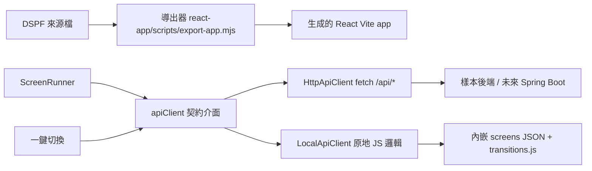

# 導出 React Vite App 設計方案

## 0. 變更記錄

v1：初始方案。含樣本後端、未來 Spring Boot 對接、以及「舊後端」一鍵切換（E-6）。

## 1. 目標

- 把設計中的 DSPF 畫面導出成可獨立運行的 React Vite app。
- 導出的 app 顯示畫面、接受輸入、按 F 鍵後呼叫後端、顯示下一畫面。
- 附樣本後端，實作同一份 API 契約。
- 未來 Java Spring Boot 照契約實作，前端零改動替換。
- 一鍵切換「舊後端」（現有純 JS 邏輯，零伺服器）與「新後端」（HTTP API）。

「舊後端」指本專案既有的架構：所有邏輯都是瀏覽器內的純 JS 模組（parseDspf、model、writer），零網路。導出的 app 保留這個模式作為離線模式。

## 2. 架構



關鍵：契約先行。樣本後端就是契約的參考實作。Spring Boot 換掉樣本後端即完成對接。ScreenRunner 只依賴契約介面，不感知底下換了誰。

## 3. API 契約

| 端點 | 方法 | 請求 | 回應 |
|---|---|---|---|
| `/api/screens` | GET | 無 | `{ screens: [{ name, recordType }] }` |
| `/api/screens/{name}` | GET | 無 | DspfDocument JSON（`doc.toJSON()` 的形狀） |
| `/api/transaction` | POST | `{ screen, aid, fields: { FIELD_NAME: value } }` | `{ nextScreen, messages: [], fieldValues: {} }` |
| `/api/health` | GET | 無 | `{ status: 'ok' }` |

細節：

- `screen` 是畫面名稱（導出時由記錄名決定）。
- `aid` 值域：`ENTER`、`CLEAR`、`F01` 到 `F24`、`CF01` 到 `CF24`、`CA01` 到 `CA24`、`CLEAR`。與 DSPF 的 command key 對應。
- `messages`：狀態列或錯誤列文字（對應 MSG 欄位語意）。
- `nextScreen`：null 表示留在目前畫面。
- `fieldValues`：後端處理後回寫的欄位值。
- 子檔輸入：欄位值以 `{列號}.{欄位名}` 為鍵（如 `1.NAME`），契約明訂。
- 全部 JSON、UTF-8。
- Spring Boot 以 `@RestController` 實作四個方法。CORS 需允許前端 dev server 來源。

## 4. 樣本後端

- Node 零依賴 http server：`backend/server.mjs`，約 150 行，port 8787。
- 服務 `backend/screens/*.json`（導出時寫入，內容即 DspfDocument JSON）。
- transaction 處理：轉移表 `backend/transitions.json`，形如：
  `{ "SIGNON": { "F03": { "nextScreen": "MENU" } }, "MENU": { "ENTER": { "messages": ["選單未實作"] } } }`
- 欄位值回顯：`fieldValues` 原樣回傳提交值（示範用）。
- 可 `node server.mjs` 直接跑，`curl` 即可測試。

## 5. 導出機制

選項 A（推薦）：CLI 腳本。

```sh
node react-app/scripts/export-app.mjs 檔案.DSPF -o ./exported-app
```

- 產出真實資料夾，可直接 `npm install` 與 `npm run dev`。
- 可自動化測試（生成產物結構比對、生成的 app 跑 E2E）。
- 輸入檔編碼：DSPF 來源可能是非 UTF-8（QDDSSRC 類），腳本需接受 `--encoding` 參數，預設 utf8，失敗時提示改用指定編碼（如 `big5`、`ibm850`）。

選項 B（後續增強）：瀏覽器 Export 選單 → JSZip 打包下載。需加 JSZip 相依，無法自動化測試。

## 6. 生成 app 的結構

```
exported-app/
├── package.json / vite.config.js / index.html
├── src/
│   ├── main.jsx / App.jsx        # 外殼：畫面切換、訊息列、模式開關
│   ├── ScreenRunner.jsx          # 單畫面執行器：grid + 欄位輸入 + AID
│   ├── api/
│   │   ├── contract.js           # 契約介面（四個方法）
│   │   ├── httpClient.js         # fetch 實作
│   │   ├── localClient.js        # 原地 JS 實作（內嵌 JSON + transitions.js）
│   │   └── useApi.js             # switcher hook
│   ├── runtime/                  # 複製自設計器的繪製元件與依賴閉包
│   │   ├── DspfGrid.jsx / DspfItem.jsx / FieldItem.jsx / ConstantItem.jsx
│   │   ├── EnptuiWidgets.jsx / InteractiveItems.jsx / RecordChrome.jsx
│   │   ├── SubfileBand.jsx / itemStyle.js / simulation.js
│   │   └── lib/                  # @dspf 依賴閉包（styleResolver、keywordReaders、
│   │                             #   metrics、theme、windowSpec、hitTest、
│   │                             #   model/keywords、Attributes.js、constants.js）
│   └── screens.json              # 內嵌畫面 JSON（local 模式用）
├── backend/
│   ├── server.mjs                # 樣本後端
│   ├── transitions.json          # 轉移表
│   └── screens/*.json            # 畫面 JSON
└── README.md                     # 執行方式 + API 契約 + Spring Boot 對接說明
```

執行期元件複製既有 preview 元件（GPLv3 同專案）。導出腳本要解析 `@dspf/*` 的 import 相依閉包，把需要的模組一起複製並改寫 import 路徑。

## 7. 舊後端相容 switcher（E-6）

契約介面：

```js
// src/api/contract.js
// getScreens() → [{ name, recordType }]
// getScreen(name) → DspfDocument JSON
// transaction({ screen, aid, fields }) → { nextScreen, messages, fieldValues }
// health() → { status }
```

兩個實作：

| | HttpApiClient | LocalApiClient |
|---|---|---|
| 網路 | `fetch /api/*` | 零網路 |
| 畫面來源 | 後端 | 內嵌 screens.json |
| transaction | 後端轉移表 | 內嵌 transitions.js（與 transitions.json 同資料） |
| 適用 | 樣本後端 / Spring Boot | 離線、demo、CI 測試 |

切換方式：

- 執行期按鈕：外殼加「後端：HTTP / 本地」開關，一鍵切換，選擇存 localStorage。
- URL query：`?api=local` 或 `?api=http` 覆寫。
- 自動降級：HTTP 模式啟動時探測 `/api/health`；失敗時狀態列提示，可一鍵切到本地。
- 優先序：query > localStorage > 預設 http。

`useApi()` hook 依目前模式回傳正確的實作。ScreenRunner 不感知切換。

## 8. 執行期行為

- 畫面載入：`getScreen(name)` → 建立 runtime 狀態。
- 欄位：可輸入（值存在 runtime state，不寫入設計 JSON）。僅 usage I 或 B 的欄位可輸入。
- 互動元件：pushbtn、choice 沿用模擬層（AID 記錄、選取切換）。`*AUTOENT` 的 choice 選中即送出 transaction。
- 提交：Enter 或 F 鍵 → `transaction(...)` → `nextScreen` 載入下一畫面；`messages` 顯示在訊息列。
- 子檔：逐列輸入，提交時以 `{列號}.{欄位名}` 傳送。
- usage H 欄位不顯示也不傳送。DSPATR(ND) 欄位可輸入但不顯示值。

## 9. 與既有 React 預覽的關係

- 設計器右側預覽是「設計期」顯示；導出的 app 是「執行期」顯示。
- 兩者共用同一批繪製元件，顯示零分歧。
- 差異只在互動層：設計器互動寫模擬層；執行期互動走契約介面。

## 10. 階段計畫

| 階段 | 內容 | 測試 |
|---|---|---|
| P1 | API 契約 + 樣本後端 | curl：screens list、transaction 轉移、health |
| P2 | 導出器 CLI（相依閉包解析 + 複製 + import 改寫） | 生成產物結構比對 |
| P3 | 生成的 app（ScreenRunner + 雙客戶端 + switcher） | 生成 app 內 vitest + Playwright：載入 → 輸入 → 提交 → 下一畫面 |
| P4 | 對接測試（生成 → npm install → 樣本後端 → E2E 全流程） | Playwright 跨 app |
| P5 | Spring Boot 對照（可選：樣板 controller + 契約文件） | 契約相符檢查 |

## 11. 決定事項

| 編號 | 議題 | 決定 |
|---|---|---|
| E-1 | 導出機制 | A：CLI 腳本（zip 列後續） |
| E-2 | 畫面 JSON 來源 | A：後端提供 + 內嵌一份（local 模式用） |
| E-3 | 執行期元件 | A：複製既有 preview 元件 |
| E-4 | 樣本後端 | A：Node 零依賴 |
| E-5 | 導出產物位置 | A：`react-app/export/` 輸出目錄 |
| E-6 | 舊後端相容 switcher | A：契約介面 + 雙客戶端 + 一鍵切換 + 自動降級 |

## 附錄 A：契約範例

請求：

```json
POST /api/transaction
{
  "screen": "SIGNON",
  "aid": "ENTER",
  "fields": { "USER": "admin", "PASSWD": "secret" }
}
```

回應：

```json
{
  "nextScreen": "MENU",
  "messages": ["Welcome, admin."],
  "fieldValues": {}
}
```

health：

```json
{ "status": "ok" }
```
