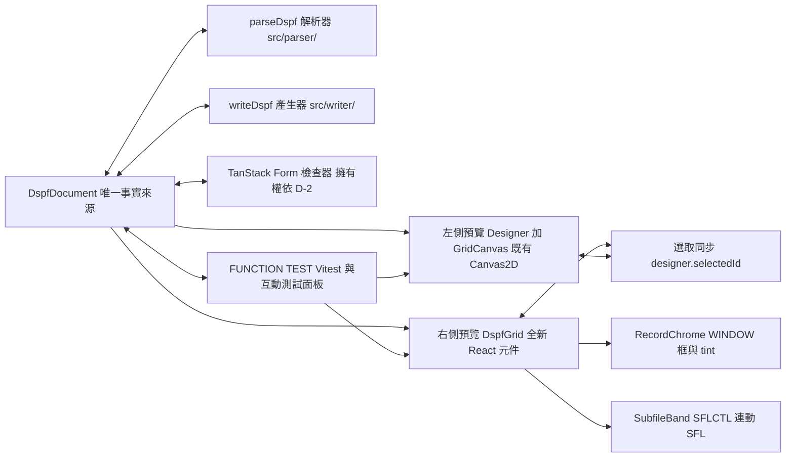

# 現代化 React 預覽與測試面板 詳細計劃（v2）

## 0. 變更記錄

v2 由兩位領域專家審查後修正。React 專家與 IBM i 專家各回報一輪，共 30 項發現，12 項雙方獨立命中。本版修正盲點，把需要取捨的項目列為待決定事項（第 2 節與附錄 A）。

主要修正：

- 定位規格補 span、clamp、minmax(0,1fr)。
- 補 WINDOW、SFLCTL 連動、overlay 規格。
- 補 item id 重生、REFFLD 前置計算、檢查器擁有權。
- 補測試基建 stub、往返比對 tuple、對位方法。
- 執行期外觀項目列為待決定事項。

v2.1：10 項決定已由使用者確認鎖定（見第 2 節與附錄 A）。

執行拆解見 `updating_plan_tickets.md`：15 個垂直切片 ticket、DAG 依賴、波次、共用契約與 Vitest 測試規格。本文件是規格，tickets 檔是執行單元。

## 1. 目標

- 複用既有解析邏輯，不重寫模型與解析器。
- 右側以 React 元件顯示 DSPF 畫面，位置與左側畫布一致。
- 表單用 TanStack Form，編輯即時寫回文件。
- 自動化測試確認 React 元件與 Canvas2D 繪製功能對等。
- 支援互動測試：點擊、勾選、輸入、拖放。

## 2. 決定事項（已鎖定）

| 編號 | 議題 | 決定 | 內容 |
|---|---|---|---|
| D-1 | 列高與長寬比 | A | fr 加 aspect-ratio |
| D-2 | 檢查器擁有權 | A | TanStack 接管，legacy 退休 |
| D-3 | 表單提交時機 | A | onChange 即時加 resync |
| D-4 | BLINK 顯示 | A | 靜態透明度 0.7 |
| D-5 | EDTCDE 與 EDTWRD | B | 明訂 out of scope |
| D-6 | push button 佈局 | A | 對等 canvas 橫排 |
| D-7 | 鍵盤互動 | B | 滑鼠 only 先 |
| D-8 | 互動 state 存放 | A | 模擬層 |
| D-9 | COLOR 缺色 | A | datalist 自由輸入 |
| D-10 | React key 策略 | A | 內容簽名 |

每項的背景、理由與影響見附錄 A。本表已由使用者確認鎖定。

## 3. 架構

核心原則：語意層完全複用 `@dspf/*`，只新增繪製層。解析、模型、度量、ENPTUI 判定都是既有純邏輯模組，React 元件直接 import。

## 4. 設計原則

| 原則 | 內容 |
|---|---|
| 單一事實來源 | 兩個預覽都訂閱同一個 `DspfDocument` 的 emit |
| 語意複用 | `metrics.js`、`keywordReaders.js`、`Attributes.js`、`entryDefaults.js` 原樣使用 |
| 對等靠共用 | 樣式與佈局解析抽成共用函數，兩邊繪製層都呼叫同一個函數 |
| 最小繪製 | 背景格線用 CSS pattern，不建立每格 div |
| 互動邊界 | 右側是可互動 UI 原型，不是 5250 模擬器 |

## 5. 對既有 src/ 的改動

新增 `src/canvas/styleResolver.js`：

- 從 `drawField.js` 抽出 `resolveItemStyle`（DSPATR 旗標、COLOR、entryDefaults 合併）。
- 從 `drawField.js` 抽出 `renderItemText`（name 補底線、日期與時間佔位）。
- 新增 `computeLayout(item, record, doc)`：計算 effectiveLength、寬度、高度（多列）、span clamp。`GridCanvas._drawRecord` 與 DspfGrid 佈局都用同一函數。
- 移除 `_drawRecord` 對 item 的無 emit 寫入，改為讀取計算結果。
- 新增 `itemSignature(item)`：內容簽名，供 React key 與選取 remap 使用。
- `drawField.js` 改為 import，行為不變。

這是唯一改動既有程式碼的地方。理由：兩邊共用同一個解析函數，結構上不可能分歧，功能對等自動成立。

## 6. 檔案規劃

全部新增在 `react-app/src/preview/`：

| 檔案 | 內容 |
|---|---|
| `DspfGrid.jsx` | Grid 容器：CSS vars、pattern 背景、overlay 層、選取層 |
| `RecordChrome.jsx` | WINDOW 框與標題、各記錄型別 tint |
| `SubfileBand.jsx` | SFLCTL 連動 SFL：重複繪製、SFLPAG clamp、scrollbar |
| `DspfItem.jsx` | 分派器：kind 加 ENPTUI 關鍵字；usage H/P skip、selected 豁免、recordOffset |
| `FieldItem.jsx` | 欄位：文字、底線、槽位、樣式 |
| `ConstantItem.jsx` | 常數：文字與 DSPATR 樣式 |
| `SysvalueItem.jsx` | 系統值：SYS_WIDTH 佔位與 sys 標記 |
| `EnptuiWidgets.jsx` | 互動元件：choice、pushbtn、menubar、CNTFLD |
| `itemStyle.js` | computeLayout 轉 CSS 樣式：span clamp、row span |
| `useSelection.js` | 選取 bus hook |
| `InspectorForm.jsx` | TanStack Form 檢查器 |
| `TestPanel.jsx` | 互動測試面板 |
| `__tests__/` | 對等測試與元件測試 |

DOM id 策略：React 側一律用 `react-grid` 前綴。不使用 `id="grid"`。既有 `getElementById('grid')` 不變。

## 7. 關鍵設計決策

### 7.1 定位規格

- `grid-template-columns: repeat(欄數, minmax(0, 1fr))`。
- `grid-auto-columns: 0`，防止越界建立隱含欄。
- 每個項目 `min-width: 0`，容器 `overflow: hidden`。
- `grid-column: col / span spanW`，spanW 是 `min(width, 欄數減 col 加 1)`。
- `grid-row: row / span spanH`，spanH 是 itemHeight（CNTFLD、choice 多列）。
- 列高與長寬比：依 D-1。
- choice 的 *NUMCOL 實際佔寬大於最寬選項。span 用實際繪製寬度。

### 7.2 效能

- 只建立項目元件，空格不建立 div。
- 背景格點用 2D pattern：`radial-gradient` 加 `background-size: calc(100% / 欄數) calc(100% / 列數)`。每 10 欄直線用 `linear-gradient`。不要用單條 gradient 假裝點狀格線。
- 項目元件包 React.memo。props 穩定，前置計算結果快取。
- 拖動項目時每個 pointermove 都會 emit。memo 防止整 grid 重繪。

### 7.3 選取同步

- selection bus 在 `bindSourceSync` 之後安裝。`designer.onSelectionChange` 由 bindSourceSync 指派。包裝必須在指派後、任何選取發生前。
- 包裝保留原 handler（游標同步與 applyHighlight）。
- `Designer.selectItem` 只在 id 改變時通知。bus 訂閱方以現值為基礎。
- adopt 後按內容簽名 remap selectedId（依 D-10）。

### 7.4 互動契約（依 D-8）

- 互動 state 只存元件本地與 TestPanel 模擬層。
- doc 寫入僅限使用者明確的 DFTVAL 編輯。
- AID 只記錄不偽造。choice 選中不寫 CHCCTL。
- 這防止把設計損壞。enptui 測試以模擬層為契約。

### 7.5 整合與 DOM id

- DspfGrid 掛在 workspace 第四欄，新容器 `#reactGridPane`。
- InspectorForm 掛載位置依 D-2。
- 不改 bindPanelResize 的既有行為。第四欄與左側 canvas 同容器尺寸。
- App.jsx mount effect 補：bus 安裝、DspfGrid 訂閱、cleanup 移除 doc.onChange 監聽。

## 8. TanStack Form 檢查器

- 相依 `@tanstack/react-form` v1，pin 版本。
- 欄位群與提交路徑：

| 欄位群 | 欄位 | 提交路徑 |
|---|---|---|
| 身分 | name、length、dataType、decimals、usage | `doc.updateItem(id, patch)` |
| 屬性 | COLOR（input 加 datalist）、DSPATR 群組 | 同上 |
| 條件 | indicators chips（`33` 或 `N34` 格式） | 同上 |
| 文字 | 常數 text、DATFMT、TIMFMT | 同上 |
| 記錄 | name、type | `onRecordPatch` |

- 擁有權：依 D-2。Designer 改接 no-op stub，legacy Inspector 退休。
- 提交時機：依 D-3。onChange 即時提交時，提交後以 doc 實際值 resync（updateItem 會 clamp）。

## 9. 測試設計：功能對等

目標是確認 React 元件與 Canvas2D 繪製功能對等。分兩層：結構對等與行為對等。

### 9.1 對等原則

- 度量與判定模組共用，不重寫。
- 樣式與佈局解析抽共用函數，兩邊繪製層消費同一函數。
- 對等表列出關鍵字組合與預期外觀，兩邊都對照同一張表。

### 9.2 測試基礎設施

新增 dev 相依：`vitest`、`jsdom`、`@testing-library/react`、`@testing-library/user-event`、`@testing-library/jest-dom`。

- `react-app/vite.config.js` 加 `test` 欄位，環境用 jsdom。
- vitest setup 檔（`react-app/src/test/setup.js`）全域 stub `ResizeObserver` 與 `HTMLCanvasElement.getContext`。GridCanvas 在 jsdom 會因為這兩項失敗。
- palette 落點改測 `specToItem` 純函數。jsdom 不支援 HTML5 DnD。
- 沿用既有 `@dspf` alias 與 CM 套件 pin。
- 新增 script：`"test": "vitest run"`、`"test:watch": "vitest"`。
- fixture 用 `?raw` import：`import src from '../../TESTS/TIME_DEMO.DSPF?raw'`，單一來源。
- 測試不 import `App.jsx`，避免 CodeMirror 依賴。只測 preview 元件與純邏輯。

### 9.3 對等測試矩陣

| 層 | 測試檔案 | 測試內容 |
|---|---|---|
| 度量與佈局 | `__tests__/position.test.jsx` | 同一 item 同一格子足跡。含 REFFLD clamp、越界 clamp、多列 span |
| 樣式 | `__tests__/parity.test.jsx` | 同一 keywords 同一 flags 與 color |
| 位置 | `__tests__/position.test.jsx` | (row, col, width) 正確 grid-column 與 grid-row |
| 外觀 | `__tests__/items.test.jsx` | DSPATR、COLOR、usage、badge、選取框、H-tag、ND 角標、sys 標記、tint |
| 行為 | `__tests__/enptui.test.jsx` | 模擬層契約：click、toggle、type |
| 往返 | `__tests__/roundtrip.test.js` | parse 後 write 再 parse，tuple 比對 |
| 同步 | `__tests__/sync.test.jsx` | doc.emit 兩邊一致。stub 後可掛載 |

### 9.4 對等表

| 輸入 | 共用解析輸出 | Canvas2D 繪製 | React 元件 |
|---|---|---|---|
| `DSPATR(HI)` | isHi true | 粗體字級 | font-weight bold |
| `DSPATR(UL)` | isUl true | 底線 | border-bottom |
| `DSPATR(RI)` | isRi true | 反白底 | 底色反白 |
| `DSPATR(ND)` | isNd true | 低透明度 | opacity 低 |
| `BLINK` | isBl true | 靜態透明度 0.7 | 靜態透明度 0.7，依 D-4 |
| `COLOR(GRN)` | color GRN | `#33ff33` | color `#33ff33` |
| usage H 或 P | isHidden true | 未選取時跳過 | 相同條件跳過 |
| `DATFMT(*MDY)` | 佔位文字 | 10/15/24 | 相同文字 |
| 進入欄位 | entryDefaults 合併 | 沿用記錄層預設 | 相同合併結果 |
| indicator | badge 文字 | `#cc6` 徽章 | 相同徽章 |
| 選取 | selected true | 藍框與底色 | 相同框線 |
| sysvalue | sys 標記 | 右上標記加 tint | 相同標記 |

EDTCDE 與 EDTWRD 格式化：依 D-5（out of scope），兩邊都不格式化。

### 9.5 位置測試

- 斷言 inline style 字串，不依賴 jsdom 版面引擎。
- 案例補齊：越界（col 85、length 79 at col 2）、多列（CNTFLD 5 列、*NUMROW 6）、REFFLD clamp、*NUMCOL 網格。
- 基礎案例：`{row: 2, col: 5, width: 10}` 在 24x80 下 `gridRow: "2 / span 1"`、`gridColumn: "5 / span 10"`。

### 9.6 行為測試

- 以 7.4 契約為準。不寫死錯誤的 5250 執行期行為。
- pushbtn 點擊、checkbox 與 radio 切換、輸入欄位打字，斷言模擬層 state。

### 9.7 往返測試

- 比對正規化 tuple：keyword 的 (name, args, indicators) 集合，item 的 row、col、length、type、usage。
- 不只比 keyword name。WINDOW 幾何、SFLCTL link、CHCCTL 引用、indicator token 都要比。
- TESTS/ 全量 fixture。A 欄有無混用都覆蓋。

### 9.8 瀏覽器對位檢查

- 比 grid-local 起點 (row, col)，不比 pixel rect 大小。
- 兩 pane 同容器尺寸。
- canvas rect 扣除 ruler 偏移（4 欄、2 列）。
- P2 與 P5 執行。

### 9.9 互動測試面板

- `TestPanel.jsx`：腳本步驟資料，逐步執行。
- 每步：動作（點擊、勾選、輸入、斷言）。
- 結果 log：PASS 或 FAIL，一鍵重跑。
- 開啟任一 TESTS/ fixture 即可整份測試。

### 9.10 邊界清單

- EDTCDE、EDTWRD：依 D-5。
- *GUTTER 執行期佈局：依 D-6。
- BLINK 動畫：依 D-4。
- runtime 關鍵字明訂 out of scope：DUP、FLDCSRPRG、WRDWRAP 折行、CHCAVAIL、*AUTOENT 送出、MNUBARDSP overlay、SFLSIZ 變數。TestPanel 只測元件行為。
- hideConditioned 只對 item.indicators 生效（與 canvas 一致）。掛在續行 keyword 的 indicator 不隱藏。本計劃不宣稱跳過所有 conditioned 項目。

## 10. 階段計畫

| 階段 | 內容 | 測試 |
|---|---|---|
| P0 | DspfGrid 唯讀版：定位規格（clamp、span）、2D pattern 背景 | position：越界、多列案例 |
| P1 | styleResolver 收斂（effectiveLength、computeLayout）、樣式語意 | parity 全綠、items 外觀 |
| P2 | 選取 bus、palette 落點、overlay、RecordChrome、SubfileBand | enptui、specToItem 純函數、瀏覽器對位 |
| P3 | TanStack Form（依 D-2 與 D-3） | 表單提交加 clamp resync |
| P4 | Vitest 基建、TestPanel、roundtrip tuple 比對 | vitest run 全綠 |
| P5 | 27x132 效能、文件更新。鍵盤互動依 D-7 在後續清單 | roundtrip 全量、對位複檢 |

## 11. 風險與防護

| 風險 | 防護 |
|---|---|
| item id 重生 | 內容簽名 key 加 remap（D-10） |
| 兩邊外觀分歧 | 共用解析與佈局函數加對等表 |
| 檢查器雙寫 | 單一擁有權（D-2） |
| 執行期外觀誤判 | 邊界清單與對等策略（D-4、D-5、D-6） |
| 表單失同步 | 提交後以 doc 實際值 resync（D-3） |
| 27x132 效能 | memo 加 2D pattern 背景 |
| jsdom 限制 | ResizeObserver 與 getContext stub，純函數測試 |
| 越界欄位撐寬 | minmax(0,1fr) 加 span clamp |
| 記錄改名觸發 adopt 迴圈 | 改名後確認 activeRecordIndex 穩定，表單 resync（T-11 驗收） |
| setModel 只 clamp 座標不 clamp 寬度 | 切小機型後長欄位全部觸發 span clamp（7.1） |

## 12. 改動量估計

- 既有 `src/`：新增 `styleResolver.js`。`drawField.js`、`GridCanvas.js` 改 import，行為不變。
- `react-app/`：新增 `preview/` 約 14 檔加測試檔。App.jsx 補整合。
- 相依：`@tanstack/react-form`（runtime）、`vitest` 等（dev）。
- 舊版靜態版：不動。

## 附錄 A：決定事項詳述
D-4 BLINK 顯示
背景：canvas 是靜態透明度 0.7，從不跳動。v1 對等表寫 CSS 動畫，與 canvas 矛盾。

決定：選項 A。靜態透明度 0.7。真對等。
捨棄選項 B：CSS 動畫跳動。runtime-like，與左側不一致，需另開專測。
影響：動畫列為後續增強。
D-5 EDTCDE 與 EDTWRD
本附錄每項都已鎖定，列出背景、決定、理由與影響。

### D-1 列高與長寬比

背景：React 專家發現固定 1.6em 列高與 canvas 等比縮放不等價。並排對位必失準。27 列乘 1.6em 約 43em，短視窗直接垂直溢出。

- 決定：選項 A。`grid-template-rows: repeat(列數, 1fr)`。容器 aspect-ratio 固定。長寬比不隨視窗漂移，對位檢查成立。
- 捨棄選項 B：固定 1.6em。實作簡單，長寬比漂移。
- 影響：容器需固定長寬比，字級隨縮放調整。

### D-2 檢查器擁有權

背景：legacy Inspector 每次 render 清空 `#inspectorBody`。React form 若掛進去會被摧毀。並行則兩個檢查器同時編輯同一 doc。

- 決定：選項 A。Designer 改接 no-op stub。legacy Inspector 退休，TanStack Form 全接管。一套檢查器，無雙寫風險。`src/inspector/` 保留不刪。
- 捨棄選項 B：並行。React form 掛兄弟節點，legacy 保留，功能劃分（legacy 管 Record，React 管 Item）。
- 影響：既有 inspector section 檔案不再被呼叫。Designer 小改。

### D-3 表單提交時機

背景：`updateItem` 會 clamp。提交後 doc 值與表單值可能不同，表單顯示過期值。

- 決定：選項 A。onChange 即時提交，提交後以 doc 實際值 resync。符合即時反映目標。
- 捨棄選項 B：submit 批次，blur 或 Enter 才提交。與 repo 的 change 慣例一致，但即時反映打折。
- 影響：表單元件需在提交後讀回 doc 值。

### D-4 BLINK 顯示

背景：canvas 是靜態透明度 0.7，從不跳動。v1 對等表寫 CSS 動畫，與 canvas 矛盾。

- 決定：選項 A。靜態透明度 0.7。真對等。
- 捨棄選項 B：CSS 動畫跳動。runtime-like，與左側不一致，需另開專測。
- 影響：動畫列為後續增強。

### D-5 EDTCDE 與 EDTWRD

背景：canvas 不套用格式化。實作格式化會與 canvas 分歧。TESTS/ 大量使用 `EDTCDE(4/Z/1/Y)` 與 `EDTWRD`。

- 決定：選項 B。明訂 out of scope。兩邊都不格式化，對等成立。
- 捨棄選項 A：在 styleResolver 實作格式化，與 5250 一致，與 canvas 分歧。
- 影響：格式化列為後續增強。

### D-6 push button 佈局

背景：canvas 全橫排，忽略 *GUTTER。執行期是垂直堆疊。

- 決定：選項 A。對等 canvas，全橫排。
- 捨棄選項 B：執行期垂直堆疊。
- 影響：執行期佈局列為後續。

### D-7 鍵盤互動

背景：canvas 有 arrow nudge、Del、Escape。計劃只定義滑鼠互動。

- 決定：選項 B。滑鼠 only 先。鍵盤列為 P5 後續。
- 捨棄選項 A：右側支援鍵盤，互動對等含鍵盤。需移植 input.js 邏輯。
- 影響：互動對等測試目前只有滑鼠動作。

### D-8 互動 state 存放

背景：choice 選中、pushbtn 點擊在 5250 是寫 CHCCTL 或送 AID。模型沒有 runtime 值槽。寫回會損壞設計。

- 決定：選項 A。互動 state 只存元件本地與 TestPanel 模擬層。doc 只寫 DFTVAL 編輯。AID 只記錄。
- 捨棄選項 B：模型加 runtime 欄位，不下檔。
- 影響：模型保持乾淨，roundtrip 穩定。

### D-9 COLOR 缺色

背景：COLOR_CSS 只有七色。5250 有 BLK、GRY、CSP。fixtures 沒用到，測試測不出，但 TanStack 下拉選不到。

- 決定：選項 A。TanStack COLOR 用 input 加 datalist，自由輸入。
- 捨棄選項 B：維持七色下拉。
- 影響：成本低。

### D-10 React key 策略

背景：item id 每次 parse 或 adopt 重生。key 用 id 會全滅，選取與表單全部失效。這是主編輯迴圈的常態路徑。

- 決定：選項 A。內容簽名（row、col、kind、name、text）當 key。adopt 後按簽名 remap 選取。
- 捨棄選項 B：改 parser 產出穩定 id。
- 影響：不動核心模型。`itemSignature` 需涵蓋同名同座標項目（indicator 條件項目），簽名加 keywords 摘要。
