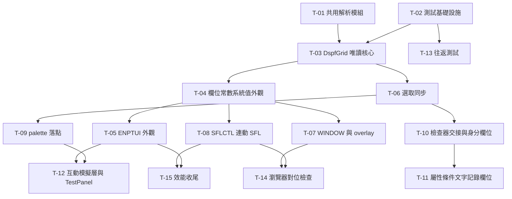

# 更新計劃 Ticket 清單（-to-ticket）

本清單把 `updating_plan.md`（v2.1，審查修正加 10 項決定鎖定）拆成小型的、自治的、依賴感知的工作單元。每個 ticket 是一個完整的功能切片，可獨立測試與示範。執行依嚴格 DAG 拓撲排序，frontier（零阻擋）ticket 可平行執行。

## 0. 方法對照

| -to-ticket 原則 | 本清單的執行 |
|---|---|
| Tracer bullets over layers | 每個 ticket 都是完整垂直切片，無「建資料表」式橫向 ticket |
| Independent verifiability | 每個 ticket 有可測試、可示範的驗收標準 |
| Context-bounded | 每個 ticket 可在單一全新上下文內完成 |
| Expand-Contract | T-10 採展開、遷移、收縮三步：先並存、再接管、最後 legacy 退休 |
| Strict DAG | 依賴邊只在硬技術門檻存在時宣告 |
| 行為導向 | 每個 ticket 從呼叫者角度寫「做什麼」，不寫行號等易腐細節 |
| Contract-first | 共用契約集中於第 2 節，跨 ticket 引用 |
| 互動精煉 | 已完成：雙領域專家審查加使用者 10 項決策鎖定 |

## 1. 依賴 DAG



### 執行波次

| 波次 | Ticket | 理由 |
|---|---|---|
| Wave 0 | T-01、T-02 | frontier，零阻擋 |
| Wave 1 | T-03、T-13 | 需要共用模組與測試基建 |
| Wave 2 | T-04、T-06 | 需要唯讀核心 |
| Wave 3 | T-05、T-07、T-08、T-09 | 需要外觀與選取 |
| Wave 4 | T-10、T-12 | 需要選取與互動基礎 |
| Wave 5 | T-11 | 需要身分欄位 |
| Wave 6 | T-14、T-15 | 需要 WINDOW、SFL、ENPTUI |

## 2. 共用契約（contract-first）

以下契約跨 ticket 引用。實作位置與細節由 T-01 決定，其他 ticket 只依賴契約形狀。

### C-1 itemSignature

```js
// itemSignature(item) → string
// 依 D-10：內容簽名當 React key 與選取 remap 依據。
// 簽名涵蓋：row、col、kind、name、text、usage、dataType、
// keywords 的 (name, args, indicators) 摘要。
// 同名同座標項目（indicator 條件項目）由 keywords 摘要區分。
```

### C-2 computeLayout

```js
// computeLayout(item, record, doc) → {
//   width,    // 格子數，含 REFFLD effectiveLength clamp
//   height,   // 格子數，CNTFLD 與 choice 多列
//   spanCol,  // min(width, doc.cols - item.col + 1)
//   spanRow,  // height
// }
// GridCanvas._drawRecord 與 DspfGrid 共用同一個函數。
```

### C-3 selection bus

```js
// installSelectionBus(designer) → { subscribe(fn), remap(doc) }
// 安裝時序：bindSourceSync 之後、任何選取發生前。
// 保留 designer.onSelectionChange 的原有 handler。
// remap(doc)：adopt 後依 itemSignature 把 selectedId 對回新 id。
```

### C-4 grid 定位

```js
// itemStyle(layout) → {
//   gridColumn: `${col} / span ${layout.spanCol}`,
//   gridRow:    `${row} / span ${layout.spanRow}`,
// }
// 容器：grid-template-columns: repeat(cols, minmax(0, 1fr));
//       grid-auto-columns: 0；項目 min-width: 0；容器 overflow: hidden。
// 列高：repeat(rows, 1fr) 加 aspect-ratio（D-1）。
// DOM id：React 側一律用 react-grid 前綴，不使用 id="grid"。
```

### C-5 form patch

```js
// InspectorForm 提交 → onItemPatch(id, patch) → doc.updateItem(id, patch)
// patch 形狀同 legacy inspector 的 onItemPatch。
// 提交後讀回 doc.findItem(id) 的實際值 resync 表單（D-3，處理 clamp）。
// COLOR 用 input 加 datalist，可自由輸入（D-9）。
```

### C-6 TestPanel step

```js
// step = {
//   action: 'click' | 'toggle' | 'type' | 'assert',
//   target: itemSignature,      // 或 CSS 選擇器
//   value,                      // type: 輸入文字；toggle: true 或 false
//   expect,                     // assert: 期望的模擬層或 doc 狀態
// }
// 執行器逐步執行並輸出 PASS 或 FAIL。
```

## 3. Tickets

### T-01 共用解析模組

- 行為：canvas 顯示行為不變，但樣式、文字、佈局與簽名邏輯改由新共用模組提供。舊繪製程式改為 import。
- 契約：C-1、C-2。
- 驗收：
  - 左側 canvas 顯示與抽取前無差異（對照 SIGNON 與 CHOICE fixture）。
  - `drawField.js` 與 `GridCanvas.js` 改 import 後行為不變。
  - 新模組可獨立 import `resolveItemStyle`、`renderItemText`、`computeLayout`、`itemSignature`。
- 依賴：無。

### T-02 測試基礎設施

- 行為：react-app 內可執行 `npm test`。jsdom 環境、全域 stub、?raw fixture import 就緒。
- 契約：無。
- 驗收：
  - `npm test` 執行一個空測試套件並通過。
  - setup 檔 stub `ResizeObserver` 與 `HTMLCanvasElement.getContext`。一個冒煙測試可掛載 GridCanvas 而不拋錯。
  - `import src from '../../TESTS/TIME_DEMO.DSPF?raw'` 成功。
- 依賴：無。

### T-03 DspfGrid 唯讀核心

- 行為：App 第四欄顯示右側預覽。SIGNON demo 以 CSS Grid 定位，含越界 clamp 與多列 span。背景用 2D pattern。訂閱 doc.emit 即時更新。
- 契約：C-2、C-4。
- 驗收：
  - 第四欄顯示 SIGNON 的 20 個項目。
  - 越界欄位（length 79 at col 2）span 被 clamp，不建立隱含欄。
  - position.test 綠：基礎、越界、多列案例。
  - 左側 `doc.updateItem` 後右側即時更新。
- 依賴：T-01、T-02。

### T-04 欄位、常數與系統值外觀

- 行為：FieldItem、ConstantItem、SysvalueItem 顯示與 canvas 對等：DSPATR、COLOR、usage H 或 P skip 加 selected 豁免、entryDefaults、日期與時間佔位、sys 標記、ND 角標、記錄 tint。
- 契約：C-2、對等表（updating_plan.md 9.4）。
- 驗收：
  - parity.test 與 items.test 全綠（對等表案例）。
  - TESTS/CHOICE 與左側視覺一致。
  - usage P 無座標欄位不疊在 (1,1)。
- 依賴：T-03。

### T-05 ENPTUI 外觀

- 行為：choice、menubar、pushbtn、cntfld 依對等 canvas 的橫排佈局繪製（D-6）。多列項目 span 正確。
- 契約：C-4。
- 驗收：
  - TESTS/PUSH_BTM_MENU 與 COLORS 的 pushbtn 橫排與左側一致。
  - CNTFLD 5 列與 *NUMROW 6 的 grid-row span 正確。
  - items.test 的 ENPTUI 外觀案例綠。
- 依賴：T-04。

### T-06 選取同步

- 行為：點右側項目 → designer.selectItem → 左側與來源同步反白。左側選取 → 右側反白。adopt 後依簽名 remap 選取（D-10）。
- 契約：C-1、C-3。
- 驗收：
  - 點右側項目，左側反白，來源游標跳到對應行。
  - 左側點選，右側同項目反白。
  - source 面板打字 300ms 後選取不丟（remap 生效）。
- 依賴：T-03。

### T-07 WINDOW 與 overlay

- 行為：WINDOW 記錄繪製框與標題（WDWTITLE、WDWBORDER），窗內項目套 recordOffset。overlay 模式非作用中記錄以整層 0.30 顯示在作用中之下。
- 契約：C-4。
- 驗收：
  - MULTI_WINDOW 與 CLOCK 的窗框、標題、窗內座標正確。
  - overlay 開關後層次正確，overlay 在 active 之下。
  - 窗內項目不畫到 (1,1)。
- 依賴：T-04。

### T-08 SFLCTL 連動 SFL

- 行為：SFLCTL 作用中時，連動 SFL 依 SFLPAG 重複繪製（key 用 id 加列號複合）。SFLSIZ 爆量 clamp 到畫面列數。SFLEND(*SCRBAR) 畫捲軸。band 底色在 SFLCTL 之下。
- 契約：C-4。
- 驗收：
  - SCROLL_BAR fixture：第 6 列模板乘 15 次 = 6 到 20 列。
  - SFLSIZ(9999) 不建立 9999 個 DOM 節點。
  - 捲軸出現於 *SCRBAR 案例。
- 依賴：T-04。

### T-09 palette 落點

- 行為：從 palette 拖到右側或 click-to-place，建立項目於正確格子，兩邊同時出現。specToItem 以純函數測試（jsdom 無 DnD）。
- 契約：C-2。
- 驗收：
  - 拖放建立項目，row 與 col 與落點一致，兩邊預覽顯示。
  - click-to-place 武裝模式在右側運作。
  - specToItem 純函數測試綠。
- 依賴：T-06。

### T-10 檢查器交接與身分欄位

- 行為：Expand-Contract。展開：TanStack Form 身分欄位（name、length、dataType、decimals、usage）與 legacy inspector 並存。遷移：選取驅動新表單。收縮：Designer 改接 no-op stub，legacy inspector 不再繪製（D-2）。onChange 即時提交，提交後以 doc 實際值 resync（D-3）。
- 契約：C-5。
- 驗收：
  - 選取項目 → 身分欄位顯示正確值。
  - 改 length → 兩邊預覽即時變，欄位值與 doc 一致（clamp 後 resync）。
  - legacy inspector 的 DOM 不再出現。
- 依賴：T-06。

### T-11 屬性、條件、文字與記錄欄位

- 行為：COLOR（datalist 自由輸入，D-9）、DSPATR 群組、indicators chips、常數 text、DATFMT 與 TIMFMT、記錄 name 與 type 表單。改名後選取與 activeRecordIndex 穩定。
- 契約：C-5。
- 驗收：
  - 改 COLOR 與 DSPATR → 兩邊即時變。
  - datalist 可輸入 BLK。
  - 改記錄名 → 兩邊與來源更新，index 不跳 0。
- 依賴：T-10。

### T-12 互動模擬層與 TestPanel

- 行為：ENPTUI 互動（pushbtn 點擊、checkbox 與 radio 切換、輸入）state 只存模擬層（D-8）。TestPanel 執行腳本步驟並輸出 PASS 或 FAIL。
- 契約：C-6。
- 驗收：
  - 指定 fixture 的腳本全 PASS。
  - 互動後 doc 不變（除 DFTVAL 編輯）。
  - AID 只記錄不偽造。
- 依賴：T-05、T-09。

### T-13 往返測試

- 行為：全量 TESTS/ fixture 執行 parse、write、再 parse。比對 tuple：keyword 的 name、args、indicators，item 的 row、col、length、type、usage。
- 契約：無。
- 驗收：
  - roundtrip.test 全量綠。
  - A 欄有無混用的 fixture 都覆蓋。
- 依賴：T-02。

### T-14 瀏覽器對位檢查

- 行為：自動化比對兩邊的 grid-local 起點 (row, col)。兩 pane 同容器尺寸。canvas rect 扣除 ruler 偏移（4 欄、2 列）。
- 契約：無。
- 驗收：
  - 對位腳本對 SIGNON、MULTI_WINDOW、SCROLL_BAR 全 PASS。
- 依賴：T-07、T-08。

### T-15 效能收尾

- 行為：項目元件 memo 化。27x132 畫面流暢。背景 pattern 複檢。捲動與溢出處理。
- 契約：無。
- 驗收：
  - 27x132 fixture 拖動與捲動流暢（瀏覽器實測）。
  - 無每格 div。
- 依賴：T-08、T-05。

## 4. 後續（不在本次 DAG）

依 D-4、D-5、D-6、D-7 明訂為後續：

- 鍵盤互動對等（arrow nudge、Del、Escape）。
- EDTCDE 與 EDTWRD 顯示格式化。
- BLINK 動畫（runtime-like 跳動）。
- push button *GUTTER 執行期垂直佈局。

## 5. Vitest 測試規格

依 `.agents/skills/vitest/`（44 條規則，8 類）。此節把各 ticket 的驗收轉成可執行的 Vitest 規格。規則名加影響等級，實作時以 reference 檔為準。

### 5.1 基礎設施規格（T-02 擴充）

- 環境：jsdom（計劃決定）。技能建議 happy-dom 以提速（perf-happy-dom），可選，不阻塞。
- setup 檔 `react-app/src/test/setup.js`：
  - stub `ResizeObserver`、`IntersectionObserver`、`matchMedia`、`HTMLCanvasElement.getContext`（env-browser-api-mocking）。canvas 冒煙測試靠這個。
  - 其餘全域不 stub。用真實模組（mock-spyon-vs-mock）。不整模組 mock `@dspf`。
- 計時：時間相依測試用 `vi.useFakeTimers()`，`beforeEach` 啟用、`afterEach` 還原（async-fake-timers）。時間相依點：300ms 解析防抖、80ms 游標防抖、2500ms flash 重置。
- 互動：一律 `userEvent.setup()`，每個動作都 `await`（async-act-wrapper）。避免 act 警告與不穩定。
- 等待：不寫固定 `setTimeout` 等待。非同步條件用 `vi.waitFor`（async-waitfor-polling）。
- 命名：`should [動詞] [結果]` 或 `when [條件]`（org-test-naming）。
- 組織：測試檔與來源檔同層（org-file-colocation）。describe 依行為分組（org-describe-nesting）。
- 資料：複用 `@dspf/model/factories.js` 的 `makeItem` 與 `keywordsFromShortcuts` 當 factory，overrides 覆寫（setup-test-factories）。不自建重複測試資料。
- 斷言：用特定 matcher（assert-specific-matchers）。樣式字串用 `toBe`，呼叫次數用 `toHaveBeenCalledOnce`，DOM 用 `toBeInTheDocument`。一測試一概念（assert-one-assertion-concept）。

### 5.2 各 ticket 測試對照

| Ticket | 測試檔（co-located） | 主要案例（名稱） | 特殊規則 |
|---|---|---|---|
| T-01 | `styleResolver.test.js` | should keep canvas rendering unchanged after extraction | 同一 item 抽離前後輸出相等 |
| T-02 | `smoke.test.js` | should mount GridCanvas without throwing | stub 生效證明 |
| T-03 | `DspfGrid.test.jsx` | should clamp out-of-bounds span；should span multiple rows for CNTFLD；should re-render when doc emits | 訂閱用 useSyncExternalStore |
| T-04 | `parity.test.jsx`、`items.test.jsx` | should map DSPATR(HI) to bold；should skip usage P unless selected；should show sys marker on sysvalue | 對等表逐列驅動 |
| T-05 | `enptui-layout.test.jsx` | should lay push buttons horizontally（D-6） | 對等 canvas 橫排 |
| T-06 | `selection.test.jsx` | should highlight both panes on click；should remap selection after adopt | fake timers：advance 300ms |
| T-07 | `window.test.jsx` | should draw WINDOW frame and title；should offset items by recordOffset | |
| T-08 | `subfile.test.jsx` | should repeat SFL items per SFLPAG；should clamp SFLSIZ(9999) | 斷言 DOM 節點數上限 |
| T-09 | `droptarget.test.js` | should build item from drop spec at given cell | specToItem 純函數；jsdom 無 DnD |
| T-10 | `inspector-form.test.jsx` | should commit name change on change event；should resync form after clamp | `await user.type` 與 `await user.click` |
| T-11 | `inspector-fields.test.jsx` | should accept BLK in COLOR datalist；should keep activeRecordIndex stable on rename | |
| T-12 | `testpanel.test.jsx`、`enptui-interact.test.jsx` | should toggle checkbox in simulation layer only；should not write doc on pushbtn click | 模擬層契約（D-8） |
| T-13 | `roundtrip.test.js` | should round-trip all TESTS fixtures with tuple equality | 全量 fixture |
| T-14 | 瀏覽器腳本 | should report PASS for grid-local positions | 非 unit 測試 |
| T-15 | 瀏覽器實測 | 27x132 拖動流暢 | 非 unit 測試 |

### 5.3 關鍵規則範例（contract-first）

setup 檔骨架（T-02，env-browser-api-mocking）：

```js
// react-app/src/test/setup.js
import { vi } from 'vitest';

globalThis.ResizeObserver = vi.fn().mockImplementation(() => ({
    observe: vi.fn(), unobserve: vi.fn(), disconnect: vi.fn(),
}));

// HTMLCanvasElement.getContext 回傳最小 2D stub，避免 GridCanvas 炸掉
HTMLCanvasElement.prototype.getContext = vi.fn(function () {
    return { save: vi.fn(), restore: vi.fn(), scale: vi.fn(), fillRect: vi.fn() };
});
```

時間相依測試骨架（T-06 remap，async-fake-timers）：

```js
it('should remap selection after adopt', () => {
    vi.useFakeTimers();
    const dspf = parseDspf(fixtureText);
    doc.adopt(dspf);
    vi.advanceTimersByTime(300);      // sourceSync 解析防抖
    expect(designer.selectedId).toBe(remappedId);
});
```

互動測試骨架（T-10，async-act-wrapper）：

```js
it('should commit name change on change event', async () => {
    const user = userEvent.setup();
    render(<InspectorForm item={item} onItemPatch={patchSpy} />);
    const input = screen.getByLabelText(/name/i);
    await user.clear(input);
    await user.type(input, 'CUSTMAST');
    expect(patchSpy).toHaveBeenCalledOnce();
    expect(patchSpy).toHaveBeenCalledWith(item.id, { name: 'CUSTMAST' });
});
```
