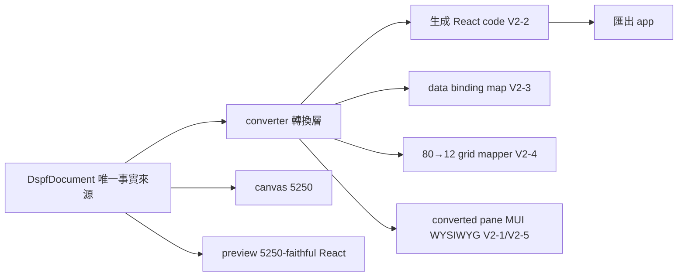
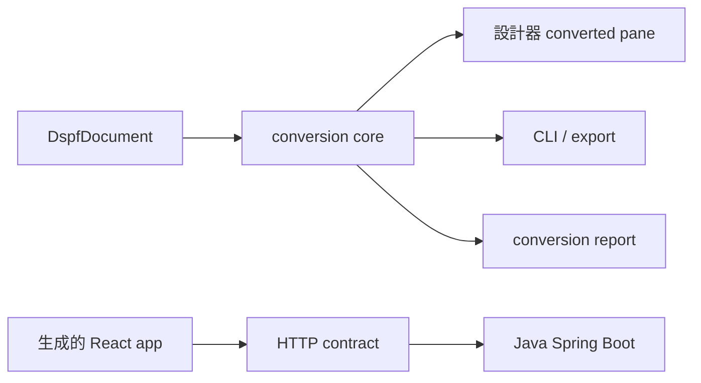

# DSPF → Modern React 轉換器 詳細計劃（V2）

## 0. 變更記錄

V2 建立在已交付的「React 預覽與測試面板」（見 `report.md` 第 1-9 節、`updating_plan.md` v2.1）之上，並接續 `export_plan.md`。本版新增**轉換層**：把 DSPF 設計轉成 modern React（Material UI）code + data binding + design system。

主要內容：

- Source 右側顯示生成的 React code（即時唯讀 + 匯出）。
- Inspector 新區：converted record/field + 轉換配置。
- Data binding：欄位 → DOM id，集中管理。
- HELP 新 TAB：轉換 logic + workflow。
- 核心演算法：80 欄 grid → 12 欄 CSS grid。
- Design system（黑白灰 + `#0f3460`）。
- OPTION vs FUNCTION 兩種顯示模式。

修訂 v2.1 的 D-4、D-6、D-9（見第 2 節）。

## 1. 目標

- 把 DSPF·RAD 擴充成轉換器：輸入 DSPF 設計，輸出 modern React app。
- 所見即所得：設計器的「converted」pane 即時用 MUI 繪製，與匯出結果一致。
- 複用既有 parse/model/writer/styleResolver；新增轉換層在其上。
- 三種顯示並存可切換：canvas（5250）、preview（5250-faithful React）、converted（modern MUI + 12-col）。

## 2. 決定事項（已鎖定）

### V2 新決定

| 編號 | 議題 | 決定 |
|---|---|---|
| V2-1 | Material UI 位置 | B：設計器加「converted」pane 即時 MUI 繪製 + 匯出同構 app（所見即所得） |
| V2-2 | codegen 性質 | A：Source 右側即時唯讀 view（隨 doc 更新）+ 匯出按鈕（下載/複製完整 app） |
| V2-3 | data binding id | B：Inspector 可編輯 per-field id，預設由 field name 產生 |
| V2-4 | grid 演算法 | A：span = round(length ÷ 80 × 12)，整數欄 + 固定 gap |
| V2-5 | 顯示共存 | A：converted 獨立 pane/tab，與 canvas、preview 並存可切換 |

### v2.1 D 決定修訂

| 編號 | 原決定 | 修訂 |
|---|---|---|
| D-4 BLINK | 靜態透明度 0.7 | 依轉換 component 配置（modern 語意，不再對等 canvas） |
| D-6 push button/choice | 對等 canvas 橫排 | OPTION vs FUNCTION 兩種顯示模式（見第 7 節） |
| D-9 COLOR/design | datalist 自由輸入 | modern design system：黑白灰 + `#0f3460`，1rem=16px，1.5x scale，單一 font（見第 4 節） |

## 3. 架構



核心原則：語意層複用 `@dspf/*`；轉換層是純函數（doc → code/binding/layout），可獨立測試。三種顯示訂閱同一 doc，互不干擾。

## 4. Design system（新檔 design.md）

| 項目 | 規格 |
|---|---|
| 顏色 | 黑、白、灰階 + 藍 accent `#0f3460` |
| 字級 | base 1rem = 16px，modular scale 1.5x（如 16 / 24 / 36…） |
| font family | 單一（建議 system sans 或一款 webfont） |
| 元件 | Material UI（依 V2-1），主題套用上述 token |

細節（contrast、spacing、icon 尺寸、focus ring）依 `.agents/skills/ui-design` 的 color / typo / layout / access references。此節寫入 `design.md`。

## 5. 核心演算法：80 → 12 grid（D.1 / V2-4）

規則：

- 每個 field 寬度百分比 = length ÷ 80。
- span = round(length ÷ 80 × 12)，clamp 到 [1, 12]。
- 欄間固定 gap（MUI Grid spacing 或 CSS `gap`）。

範例：

| field length | 寬度% | span (of 12) |
|---|---|---|
| 40 | 50% | 6 |
| 20 | 25% | 3 |
| 10 | 12.5% | 2（round(1.5)=2） |
| 79 | 98.75% | 12（clamp） |

邊界處理（實作細化）：

- 最小 span = 1，避免 0。
- 多列 field（CNTFLD、choice *NUMROW）→ row span。
- field 間空白欄 → gap，不佔 span。
- 同一 DSPF row 的多個 field → 依序排入 12-col；總 span 超過 12 時換行或縮排（規則待細化）。

## 6. Data binding（#5 / V2-3）

- 每個轉換欄位有穩定 DOM id，格式如 `id="Z=XMG3tX"`。
- 預設由 field name 產生；Inspector 新區可逐欄編輯（V2-3）。
- 集中管理 binding map：`{ fieldName → domId, recordName, dataType, usage }`。
- 生成 code 用該 id 綁定（如 `<TextField id="Z=…" />` + `data-bind`）。
- id 跨 parse/adopt 穩定（依 field name，不依 item id；item id 每次 parse 重生）。

## 7. OPTION vs FUNCTION 顯示模式（#11 / D-6）

| 類型 | DSPF 來源 | 顯示方式 |
|---|---|---|
| OPTION | choice（SNGCHCFLD/MLTCHCFLD） | 表上方水平 legend：`(ICON_X) X=ABCD - (ICON_Y) Y=CDEF…`，icon + code 對照 |
| FUNCTION | command key / push button（整頁動作：上一頁、新增記錄） | 依功能類型不同轉換（例外清單待細化） |

FUNCTION 兩種子模式：

- **11.1 combo box dropdown**：顯示文字，可輸入 X 代號。
- **11.2 每行後面水平 SVG icon**：表列內嵌動作 icon。

icon packs：Material Symbols/Icons（隨 MUI），或指定 pack（待細化）。

## 8. UI surfaces（新增）

| # | 位置 | 內容 |
|---|---|---|
| 3 | Source 右側 | 生成 React code 即時唯讀 view + 匯出按鈕（V2-2） |
| 4 | Inspector 新區 | converted record/field + 轉換配置（含 binding id 編輯器，V2-3） |
| 6 | HELP 新 TAB | 所有轉換 logic + workflow 文件 |
| V2-5 | converted pane | 獨立 MUI 繪製，所見即所得，與 canvas、preview 並存可切換 |

## 9. Output 設計（#7 / V2-1）

生成的 app：

- Material UI + design system token。
- 12-col grid 佈局（第 5 節演算法）。
- data binding id（第 6 節）。
- OPTION/FUNCTION 顯示模式（第 7 節）。
- 匯出格式依 V2-2：下載/複製完整 app（結構接續 `export_plan.md`）。

## 10. 與既有程式的關係

- 複用：parse/model/writer/styleResolver、preview 元件。
- 新增轉換模組（純函數，可獨立測試）：converter、codegen-react、binding-map、grid-mapper。
- converted pane 是第四個顯示面（V2-5），訂閱同一 doc。

## 11. 階段計畫

| 階段 | 內容 | 測試 |
|---|---|---|
| P0 | design.md + MUI 主題 token（黑白灰 + `#0f3460`） | 主題快照 |
| P1 | grid-mapper：80→12 span 演算法（純函數） | 映射表單測 |
| P2 | binding-map：id 產生 + Inspector 編輯器 | id 穩定性測試 |
| P3 | codegen-react：doc → React code（即時 view） | code 結構比對 |
| P4 | converted pane：MUI WYSIWYG 繪製（V2-5） | Playwright 對位 |
| P5 | OPTION/FUNCTION 顯示模式 + icon | 元件測試 |
| P6 | Source 右側 view + 匯出按鈕（V2-2） | 匯出產物結構比對 |
| P7 | HELP TAB：轉換 logic + workflow 文件 | （純文件） |

## 12. 風險與防護

| 風險 | 防護 |
|---|---|
| MUI 與 98.css Win98 主題衝突（V2-1） | converted pane 獨立容器，MUI theme scope 隔離；styled-engine 分離 |
| bundle 變大 | MUI 按需 import；converted pane lazy load |
| item id 重生影響 binding | id 依 field name（非 item id），跨 parse 穩定 |
| grid span 換行/縮排規則未定 | P1 先定義映射 + 邊界，單測覆蓋 |
| FUNCTION 例外類型未列全 | P5 前補例外清單 |

## 附錄：待細化項目（實作前確認）

- `Z=XMG3tX` id 的確切產生規則（field name → token 的轉換函數）。
- FUNCTION 功能類型例外清單（哪些 key/button 屬哪類、各怎麼轉）。
- icon pack 選擇（Material Symbols vs 其他）。
- converted pane 是第 4 欄還是既有區域內的 tab。
- 同一 DSPF row 多 field 總 span > 12 時的換行/縮排規則。

## 13. 程式本質與責任邊界

本程式的核心是「DSPF 語意 → modern React 結構」的轉換器，不是一般 CRUD 後端。

責任分三層：

| 層 | 責任 | 是否需要資料庫 |
|---|---|---|
| DSPF model | 解析、正規化、保留原始語意 | 否 |
| conversion core | grid、component、binding、code、報告 | 否，必須可重複產生 |
| runtime backend | 商用 app 的登入、資料、交易、權限、工作流程 | 由 Spring Boot 負責 |

Conversion core 必須是 deterministic。相同文件、相同轉換配置，必須產生相同的 code、binding map 與警告清單。它不應依賴 HTTP、SQLite 或瀏覽器狀態。

## 14. Backend 策略

### 14.1 首版決定：先做 shared conversion core，不先拆 Node service

第一階段把轉換 logic 放在可重用的純 JS module。設計器可直接使用，CLI/exporter 也可使用。這符合目前無 build backend 的架構，並避免同一套 logic 在 browser 與 Node 分裂。



### 14.2 何時才建立 Node.js conversion service

只有在下列需求成立時才拆 service：

- 多使用者同時轉換，需集中權限與工作佇列。
- CI 或批次處理大量 DSPF 檔案。
- 需要保存轉換版本、審核記錄與結果下載。
- Spring Boot 尚未接入，但團隊需要共用 HTTP conversion API。

Node service 若建立，只能包裝同一個 conversion core。它不可複製或改寫 grid、binding、component mapping。

### 14.3 Conversion API 草案

| Endpoint | Method | Purpose |
|---|---|---|
| `/api/conversions` | POST | 上傳 DSPF 或 canonical document，建立轉換工作 |
| `/api/conversions/{id}` | GET | 取得狀態、摘要、警告與版本 |
| `/api/conversions/{id}/code` | GET | 取得 generated React code 或檔案清單 |
| `/api/conversions/{id}/report` | GET | 取得 conversion report |
| `/api/conversions/{id}/download` | GET | 下載生成的 app archive |

此 API 是 conversion service 的選配介面。生成 app 的 runtime API 仍由 `export_plan.md` 的 `/api/screens` 與 `/api/transaction` 契約負責，兩者不可混成一個 endpoint。

## 15. SQLite 使用規則

SQLite 是選配的 conversion metadata store，不是 DSPF 語意的唯一來源，也不是商用交易資料庫。

可保存：

- conversion job、版本、操作者、時間與狀態。
- binding override、component override 與 layout override。
- source-to-output traceability。
- warning、error、manual review 結果。

不可直接保存為唯一來源：

- DSPF 原始文字。
- 未經版本化的 DspfDocument。
- Spring Boot runtime 的商用交易資料。

若使用 SQLite，資料表必須帶 `project_id`、`source_revision`、`converter_version` 與 `created_at`。重新轉換不得覆蓋舊結果，必須建立新 revision。

## 16. Generated app 樣板與商用完備性

### 16.1 生成檔案結構

```text
generated-react-app/
├── package.json
├── vite.config.js
├── index.html
├── README.md
├── LICENSE
├── src/
│   ├── main.jsx
│   ├── App.jsx
│   ├── router/
│   │   ├── routes.jsx
│   │   └── navigation.js
│   ├── api/
│   │   ├── contract.js
│   │   ├── httpClient.js
│   │   └── localClient.js
│   ├── conversion/
│   │   ├── bindings.js
│   │   └── screens.js
│   ├── components/
│   │   ├── AppShell.jsx
│   │   ├── Sidebar.jsx
│   │   ├── ScreenLayout.jsx
│   │   └── fields/
│   ├── theme/
│   │   └── theme.js
│   └── screens/
├── backend-contract/
│   ├── openapi.yaml
│   └── examples/
├── conversion-manifest.json
├── conversion-report.md
└── traceability.json
```

### 16.2 商用基本能力

樣板必須預留但不假造實作：

- API base URL 與 environment 配置。
- HTTP、local fallback、timeout、錯誤訊息與重試規則。
- Spring Boot 可實作的 OpenAPI contract。
- 登入、權限、CSRF/CORS、audit log 的 adapter 邊界。
- loading、empty、error、forbidden、not-found 與 offline 狀態。
- field validation、server error mapping、transaction id 與 request correlation id。
- accessibility：label、keyboard focus、ARIA、contrast、reduced motion。
- production build、source map 選項、版本資訊與健康檢查。

樣板不可把登入、權限或交易流程假裝成已完成。未提供後端資料時，使用明確的 local demo mode。

## 17. Modern React 導航

- 第一層使用 MUI `Drawer` 或等效 Sidebar，顯示 parent-level menu。
- 第二層少量項目可用 dropdown；項目多或有獨立權限時，改用 route。
- 頁面級動作使用 route transition，不使用 modal 取代頁面導航。
- 生成 app 使用 TanStack Router 時，route 代表頁面或 screen；search params 只放可分享的篩選與檢視狀態。
- TanStack Query 只管理 Spring Boot 的 server state，不管理 DspfDocument、選取或 Inspector 草稿。
- 每個 route loader 可 prefetch screen query；Suspense 必須配 Error Boundary。
- Sidebar state、暫存表單與選取屬 client state，保持在 React 或 local store。

## 18. Object、variable 與從屬關係

轉換文件提到「XXX 的 OBJECT/VARIABLE 移至 YYY 的 OBJECT」時，預設**保留從屬關係**，不可靜默扁平化。

轉換規則：

1. 為每個 source object 建立完整 symbol path：`record.field.variable`。
2. 建立 source path → target path 的 symbol map。
3. 移動 object 時，同步改寫所有已知 reference。
4. 若 target component 不支援原本的 owner，建立明確 adapter boundary，並在報告列 warning。
5. 發生名稱衝突時，不自動覆蓋；使用 scope prefix、人工 override 或停止該項轉換。
6. 只有在 conversion profile 明確選擇 `promote` 時才提升 owner scope。
7. 每次提升都記錄原 owner、目的 owner、原因與受影響 references。

因此，`XXX` 的變數移至 `YYY` 時，生成結果必須仍可追溯原始 owner。UI 可提供「保留 owner」與「提升 owner」選項，但預設使用前者。

## 19. Conversion output 與報告

每次轉換必須同時產生下列結果：

| Output | 內容 |
|---|---|
| generated source | React、theme、routes、components 與 API client |
| `conversion-manifest.json` | source revision、converter version、配置、輸入檔 hash、輸出檔 hash |
| `conversion-report.md` | summary、完成項、warning、error、manual review、未支援語意 |
| `traceability.json` | DSPF record/item → React file/component/DOM id |
| `binding-map.json` | field name、record、dom id、data type、usage、validation |
| `conversion-log.jsonl` | 每個 object 的轉換事件與結果 |

報告必須區分：

- `converted`：已產生且有對應 output。
- `manual-review`：產生暫存 component，但需人員確認。
- `unsupported`：沒有安全的轉換方式，不產生假 code。
- `error`：轉換中止或輸入不完整。

## 20. 實作波次與驗收

| Wave | Scope | Acceptance |
|---|---|---|
| V2-0 | 建立 conversion domain model、profile、symbol path | canonical input 與 deterministic output |
| V2-1 | design.md、MUI theme、12-grid mapper | table-driven grid tests、responsive screenshots |
| V2-2 | binding map、DOM id、Inspector converted section | id stable、override、collision warning |
| V2-3 | converter component mapping、OPTION/FUNCTION | mapping matrix、unsupported report |
| V2-4 | converted pane 與 Sidebar/navigation | Playwright WYSIWYG 與 route checks |
| V2-5 | Source React code view、read-only sync、copy/export | doc change updates code and manifest |
| V2-6 | generated app template、API contract、local client | generated app build、local transaction flow |
| V2-7 | conversion report、traceability、Help tab | report covers every source object |
| V2-8 | optional Node service、SQLite metadata | API contract tests、revision isolation |
| V2-9 | Spring Boot handoff package | OpenAPI examples、CORS/auth boundary、integration checklist |

每一波必須先通過純函數與 contract tests，再做 Playwright UI 測試。任何未支援 DSPF 語意都必須出現在報告，不可靜默遺失。

## 21. 主要風險與取捨

| 風險 | 取捨與防護 |
|---|---|
| MUI 增加 bundle 與維護成本 | 只在 converted pane 與 generated app 使用；按需 import、lazy load |
| 12-grid 失去原始座標精度 | 保留 source row/col traceability；modern layout 可人工 override |
| browser 與 Node logic 分裂 | 只允許一份 conversion core；service 只包裝 core |
| SQLite 被誤當商用 DB | 限定 metadata；交易資料交給 Spring Boot |
| object ownership 被靜默改變 | symbol map、owner policy、collision stop、conversion report |
| OPTION/FUNCTION 例外過多 | mapping matrix + manual-review 狀態，不產生假設 code |
| 生成結果看似完整但不能商用 | manifest、OpenAPI、錯誤狀態、權限邊界與報告列為輸出 |

## 附錄：預設決策

若未另外確認，採用下列保守預設：

- conversion core 先留在 shared JS module，不先建立 Node service。
- SQLite 僅作 revision、配置與報告 metadata store。
- generated app 使用 MUI、TanStack Router、TanStack Query；設計器的 DspfDocument 不放入 Query cache。
- Sidebar 第一層用 Drawer，第二層少量項目用 dropdown，多數或有權限差異的項目用 route。
- object/variable 預設保留 owner，任何 promotion 都需明確配置並寫入 traceability。
- 轉換失敗或語意未支援時輸出 warning/manual-review，不輸出誤導性的完成 code。
