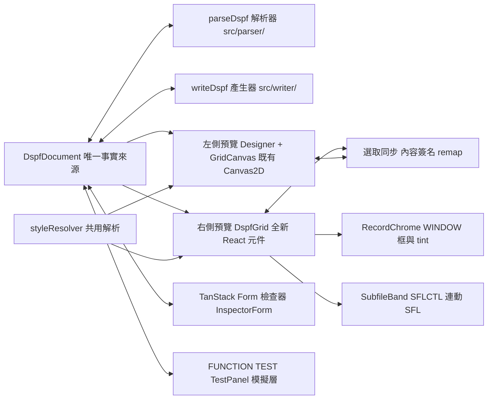

# DSPF·RAD React 現代化 完整報告

## 1. 摘要

本專案把 DSPF·RAD 的顯示層現代化：右側新增 React 預覽，與左側既有 Canvas2D 畫布共用同一份 `DspfDocument`。解析、模型、產生、度量全部複用既有純 JS 模組，零重寫。檢查器改用 TanStack Form。內建互動模擬層與 FUNCTION TEST 面板。自動化測試確認兩邊繪製層功能對等。

最終狀態：

| 項目 | 數字 |
|---|---|
| 執行 ticket | 15 / 15（6 個波次） |
| vitest 測試 | 99 / 99（14 檔） |
| Playwright E2E | 16 / 16（smoke 13 + parity 3） |
| vite build | 成功 |
| 既有 src 改動 | 新 1 檔，改 4 檔（行為不變或修正缺陷） |

## 2. 背景與目標

DSPF·RAD 是瀏覽器端的 IBM i 顯示檔設計器。原版是純靜態 ES modules，無建置、無測試。目標是：

- 新增右側 React 預覽，位置與左側畫布一致。
- 表單用 TanStack Form，編輯即時寫回文件。
- 自動化測試確認 React 元件與 Canvas2D 功能對等。
- 支援互動測試：點擊、勾選、輸入、拖放。

執行方式：依 `updating_plan.md`（v2.1，雙領域專家審查 + 10 項決定鎖定）與 `updating_plan_tickets.md`（15 張 ticket）分波執行。

## 3. 架構



核心原則：

- 語意層完全複用 `@dspf/*`（`../src`），只新增繪製層。
- 對等靠共用：樣式、文字、佈局、簽名都出自同一個 `styleResolver.js`。
- React key 用內容簽名（D-10）：item id 每次 parse 重生，簽名跨 adopt 穩定。

## 4. 交付物

### 4.1 既有 src 的改動

| 檔案 | 改動 |
|---|---|
| `src/canvas/styleResolver.js` | 新增。`resolveItemStyle`、`renderItemText`、`computeLayout`、`itemSignature`，兩邊繪製層共用 |
| `src/canvas/drawField.js` | 樣式與文字解析抽到 styleResolver，行為不變 |
| `src/canvas/GridCanvas.js` | effectiveLength 改從共用 computeLayout 取值 |
| `src/parser/lineFilter.js` | `+` 續行保留分隔空格（缺陷修正，見 7.1） |
| `src/writer/line.js` | token 間斷行時空格留在 `+` 之前（缺陷修正，見 7.1） |

### 4.2 react-app/src/preview/（15 檔 + 11 測試檔）

| 檔案 | 內容 |
|---|---|
| `DspfGrid.jsx` | CSS Grid 容器、overlay 層、SFL 連動、點擊選取、拖放 |
| `DspfItem.jsx` | 分派器（memo + 簽名比較器） |
| `FieldItem.jsx` / `ConstantItem.jsx` / `SysvalueItem.jsx` | 內容元件，對等 drawField/drawText |
| `EnptuiWidgets.jsx` | ENPTUI 靜態外觀（choice/menubar/pushbtn/cntfld） |
| `InteractiveItems.jsx` | 互動模擬層（choice 切換、pushbtn AID） |
| `RecordChrome.jsx` | WINDOW 框、標題、auto-pos 徽章 |
| `SubfileBand.jsx` | SFLCTL 連動 SFL、SFLPAG 重複、SFLSIZ clamp、捲軸 |
| `InspectorForm.jsx` | TanStack Form：記錄 + 身分 + 屬性 + 條件 + 文字欄位 |
| `TestPanel.jsx` | 互動 FUNCTION TEST 執行器 |
| `simulation.js` | 互動 state 模擬層（D-8，不寫 doc） |
| `useSelection.js` | 選取 bus（含 adopt 後簽名 remap） |
| `itemStyle.js` / `dropMath.js` | 定位樣式與拖放格子數學 |

### 4.3 測試與 E2E

- `src/preview/__tests__/`：11 檔（position、items、window、subfile、enptui-layout、droptarget、selection、simulation、inspector-form、inspector-fields、testpanel）。
- `src/test/`：smoke + styleResolver + roundtrip（全量 TESTS/ fixture 19 檔）。
- `e2e/`：`smoke.spec.js`（13 測試）、`parity.spec.js`（3 測試）。

## 5. 各波次摘要

| 波次 | Ticket | 內容 | 測試 |
|---|---|---|---|
| Wave 0 | T-01 | styleResolver 共用解析模組 | 16（parity 基礎、layout、簽名） |
| Wave 0 | T-02 | vitest 基建（jsdom、stub、?raw fixture） | 2（冒煙） |
| Wave 1 | T-03 | DspfGrid 唯讀核心（clamp/span/背景 pattern） | position 5 |
| Wave 1 | T-13 | 全量 fixture 往返 tuple 比對 | 20（19 fixture） |
| Wave 2 | T-04 | 欄位/常數/系統值外觀對等 | items 11 |
| Wave 2 | T-06 | 選取 bus 與簽名 remap | selection 6 |
| Wave 3 | T-05 | ENPTUI 外觀（代理移植） | enptui-layout 4 |
| Wave 3 | T-07 | WINDOW 與 overlay（代理移植） | window 4 |
| Wave 3 | T-08 | SFLCTL 連動 SFL（代理移植） | subfile 2 |
| Wave 3 | T-09 | palette 落點與格子數學 | droptarget 9 |
| Wave 4 | T-10 | TanStack Form 交接與身分欄位 | inspector-form 4 |
| Wave 4 | T-12 | 互動模擬層與 TestPanel | simulation 5 + testpanel 2 |
| Wave 5 | T-11 | 屬性/條件/文字/記錄欄位 | inspector-fields 8 |
| Wave 6 | T-14 | 瀏覽器對位檢查 | parity 3（E2E） |
| Wave 6 | T-15 | 效能收尾（memo + 簽名擴充） | 全量回歸 |

## 6. 測試與測試方法

- vitest 99 測試全綠，jsdom 環境，setup 檔 stub `ResizeObserver`、`matchMedia`、canvas `getContext`。
- Playwright 16 測試全綠，自動起 preview server。
- parity 測試對同一份 doc 逐項目確認兩邊 grid-local 座標一致：
  - React 側：DOM rect → 座標，對照 inline grid 樣式。
  - Canvas 側：像素中心 → `cellAt` 回推。
  - fixture：SIGNON、MULTI_WINDOW（窗內 offset）、SCROLL_BAR（27x132 + SFL 重複列）。
- roundtrip 測試：TESTS/ 全部 19 個 fixture 執行 parse、write、再 parse，比對 keyword 的 (name, args, indicators) tuple 與 row/col/length/type/usage。

## 7. 發現並修復的缺陷

| # | 缺陷 | 修正 |
|---|---|---|
| 1 | writer 的 `+` 續行在 token 間斷行時遺失分隔空格，`&R2; &C2;` 重解析併成一個 | line.js 保留空格在 `+` 之前；lineFilter.js 對結尾 `+` 的行不 trim（影響 4 個 fixture） |
| 2 | item id 每次 parse 重生，選取/表單/React key 全失效 | 內容簽名當 key；adopt 後依簽名 remap |
| 3 | App 首次 render 傳 null bus，`useSelection(null)` 崩潰 | hook 內防護 |
| 4 | bus 在 effect 內建立但 JSX 引用，boot 即炸 | 改為 state 傳遞 |
| 5 | remap 被 Designer._refresh 搶先清空選取 | 改以 adopt 前簽名為主 |
| 6 | Designer.selectItem 不通知無變化，清除案例 bus 不更新 | remap 後主動同步 |
| 7 | jsdom 寬度 0，cellW 除零 | 量測 guard（w > 0） |
| 8 | vitest globals:false，testing-library cleanup 未註冊 | setup 加 afterEach cleanup |
| 9 | R 行裸 type keyword 與續行 `WINDOW(...)` 產生雙 keyword，find 命中空 args | E2E fixture 改內聯 args（與 canvas 語意一致） |
| 10 | memo + 原地 mutation，length 更新不重繪 | 內容簽名比較器；簽名納入 length/decimals |
| 11 | sub-pixel 捨入，floor 在欄位邊界翻車 | 對位檢查改用 round |
| 12 | 表單 resync 比對轉換值而非原始輸入 | commit 帶 transform，resync 與 raw 比對 |
| 13 | ResizeObserver mock 用 arrow 不可 new | 改用普通函數 |
| 14 | 測試 fixture 建行器欄位偏移（3 次） | 標準化精確建行器 |

## 8. 已知限制與後續

依 D-4、D-5、D-6、D-7 明訂為後續：

- 鍵盤互動對等（arrow nudge、Del、Escape）。
- EDTCDE 與 EDTWRD 顯示格式化（兩邊都不格式化，對等成立）。
- BLINK 動畫（目前是靜態透明度 0.7，與 canvas 一致）。
- push button *GUTTER 執行期垂直佈局（目前對等 canvas 橫排）。
- `src/inspector/` 的 legacy DOM 檢查器保留未刪（Designer 已接 no-op stub）。
- 根目錄舊版靜態版保留未動，與 react-app 並存。
- react-app 的 Docker 部署未做（`npm run build` 產物可直接靜態伺服）。

## 9. 執行方式

```sh
cd react-app
npm run dev          # 開發（port 5173）
npm run build        # 生產建置
npm test             # vitest 全量
npm run test:watch   # 監看模式
npx playwright test  # E2E（自動起 preview server）
```

除錯面：`window.dspfRad`（doc、designer、parse、write、load）保留。
